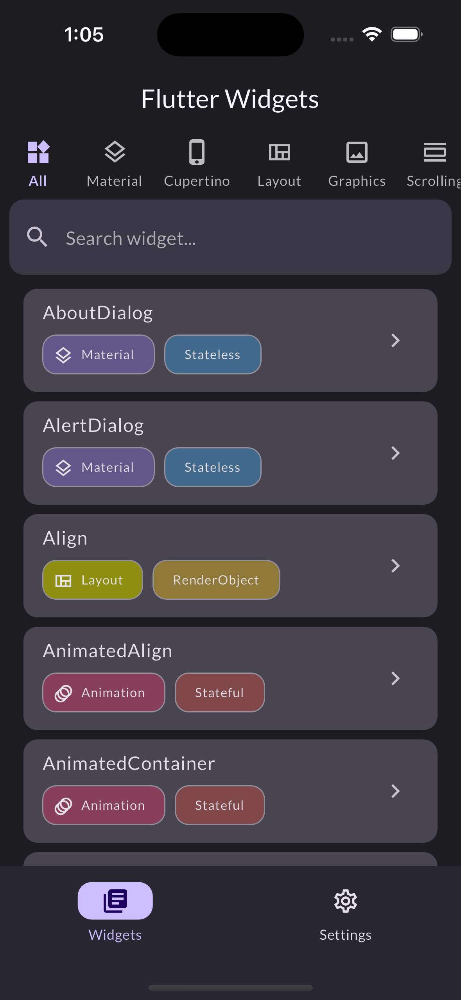
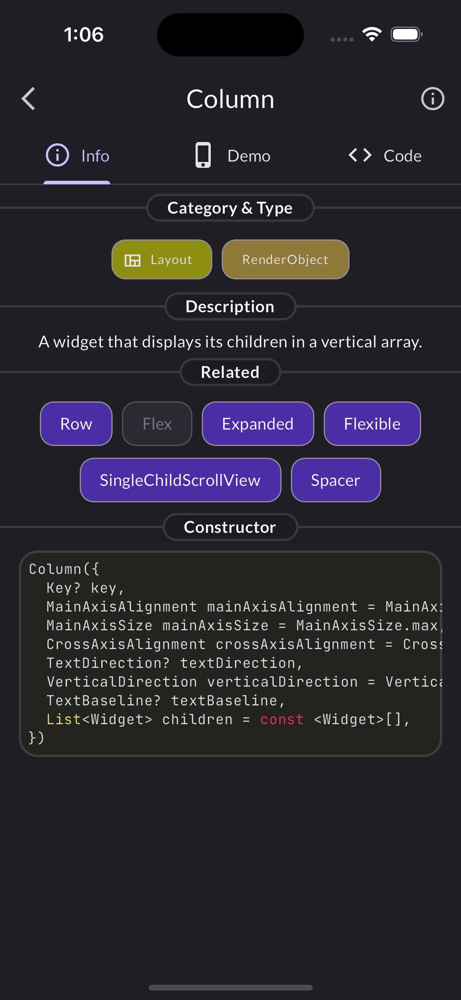
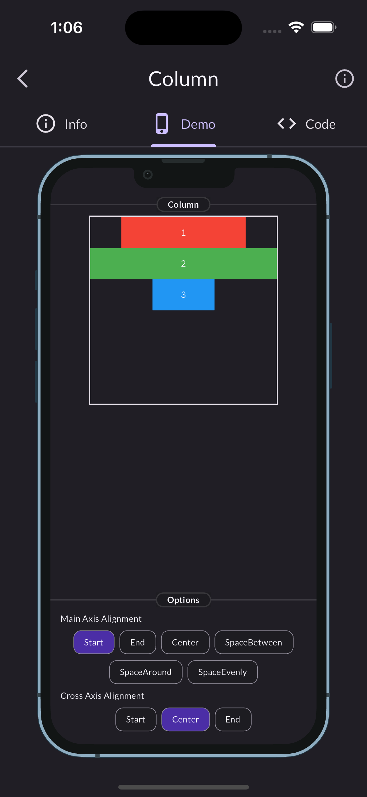
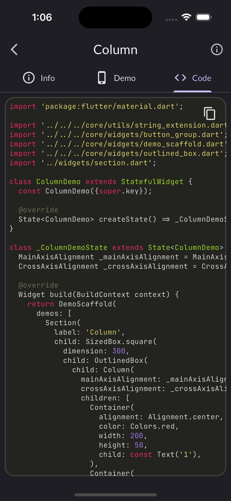
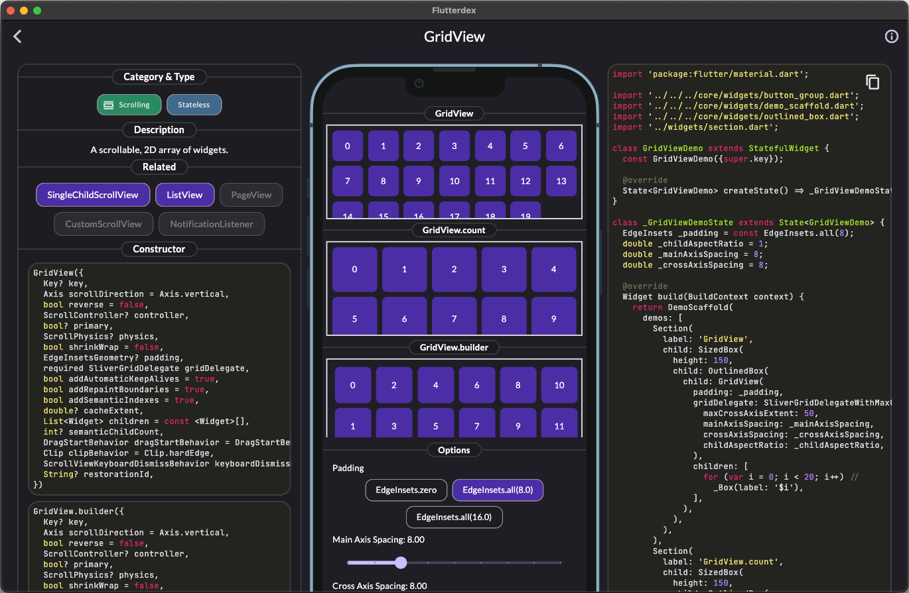
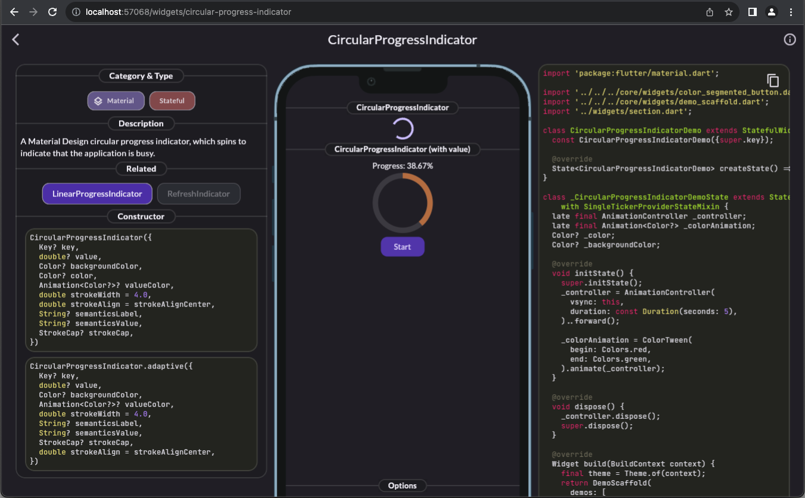

# Flutterdex

Flutterdex is an application to demonstrate widgets available in Flutter. The web version of the app is available [here](https://charlescyt.github.io/flutterdex/).

## Screenshots

| Home Page                                   | Widget Info                   |
| ------------------------------------------- | ----------------------------- |
|  |  |

| Widget Demo                   | Demo Code View                |
| ----------------------------- | ----------------------------- |
|  |  |

| macOS                   |
| ----------------------------- |
| |

| Web                |
| ----------------------------- |
|   |

## Features

- Widgets information
- Interactive demos
- View demo source code

## Motivation

There are so many widgets that come with Flutter, and it can be difficult to remember them all and understand how to use them effectively. I created this project to learn and discover new widgets and I hope others find this project a useful reference as they start their Flutter journey.

## Contributing

Contributions are appreciated! You can contribute by:

- Creating an issue to report a bug or suggest a new feature.
- Submitting a pull request to fix a bug or implement a new feature.

## License

Flutterdex is licensed under the [MIT License](LICENSE).
